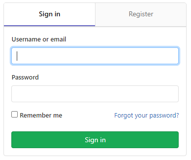
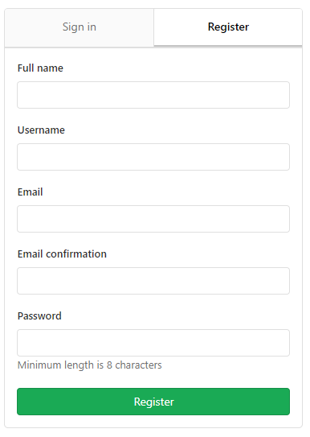

# authorization-service

## 😒 프로그램 개요
- STOVE DEV CAMP의 개인 2차 프로젝트를 수행하기 위한 레포지토리입니다.
- 인증 서비스를 구현합니다.

## ✔ 요구사항
- 회원가입, 로그인 페이지 구현
- 유저 관리 페이지 구현
- 인증 서버 (API) 구현
- MySQL DB 사용
- 암호화 알고리즘 사용
- 캐시 활용
- E-mail 인증 기능 구현
- 비밀번호 찾기 구현

## 👍 주요 구현 목표
- 암호화 알고리즘 구현 (SHA-256)
- OAuth2 인증서버 구현
- MySQL로 DB 설계 및 구현
- Spring AOP를 이용해 캐시 적용 (Redis)

## 👌 구현할 기능 목록
- 암호화 알고리즘
  - 해싱 (SHA-256)
  - SALT (java.security.SecureRandom 이용)
  - key-stretching  
- 회원가입
  - 이메일 인증
  - Vaildator (아이디, 비밀번호, 이메일) - ajax
- 로그인
- 로그아웃
- 회원 관리
  - CRUD
  - 회원 관리하는 관리자 페이지 구현
- 비밀번호 찾기
  - 이메일 인증
  - 임시 비밀번호 생성
  - Vaildator (이메일)
- 마이페이지
  - 비밀번호 변경 가능
  - 회원 탈퇴 가능

## 😁 레퍼런스
GITLAB

